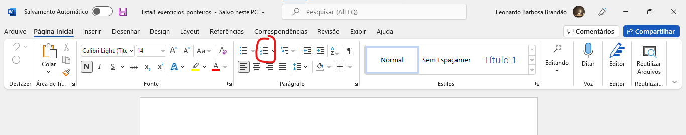

<h1 align="center">WDCA <small>(Word Document Construction Automation)</small> 🐍🤖</h1>
 
 
An automation for word document construction with specific formatting and sequence of events.

## Table of contents
<!--ts-->
   * [Table of contents](#table-of-contents)
   * [Simple Demonstration](#simple-demonstration)
   * [Instructions](#instructions)
      * [Initial Config](#initial-config)
      * [Events sequence](#events-sequence)
   * [Technologies](#technologies)
   * [Author](#author)
<!--te-->

## Simple Demonstration
Here's an example in practice of the automation running

## Instructions
This is the **most important** section. 

I created the automation with the only purpose of building an exercises list file for some subjects at my college. Therefore, there's a static sequence of events, in other words, it's not possible customize the tasks or their sequence, unless of course that you change the code.

Furthermore, in the events where a mouse position is requested, it is obtained right after the window requesting the mouse position is closed. Therefore, position the mouse where requested and without moving it, close the window requesting the position by pressing the 'enter' key.

---

* ### **Initial Config**
   If it's your first time using the automation, you'll must configure some settings about your screen. The automation needs of some fixed mouse positions of your screen, which may be different from mine, as the screens are likely to have differents size. These positions remain saved in file *'mouse_positions'* and will be used for mouse clicks, thus take care with this file. If you want to reset the positions you must delete **ALL** the file content. The automation checks if the file is **empty** before start.
      
   * Required Mouse Positions
  
      * Enumerador do Word
      
           
      
      * Caixa de Fonte
      
          
      
      * Caixa de Tamanho da Fonte
      
          
      
      * Seção Inserir
      
          
      
      * Opção Tabela
      
          
      
      * Tabela 1x1
      
          
      
      * Seção Página Inicial 
      
          

* ### **Events Sequence**
  As explained, there is a static sequence of events that will be cited here in the order in which they occur.

   * Range of Questions
      
You will be asked for the first and final questions number.

   
   * Question Mouse Positions
      
      **ATENTION:** This step **will be repeated** based on the numbers informed in the previous step. You should be in the document window with the questions and the document should be positioned at the top.
      
      So first you will be asked if you need to scroll down the page to capture the entire current question. In case it is not necessary, you will have to position your mouse where the question starts and then where it finishes - these positions will be used to simulate the mouse drag moviment with the left button pressed (select the question and then copy it). 
      
      On the other hand, if you need to scroll down the page to capture the entire current question, you will have to press the _'down'_ key (down arrow) and count how many times you pressed it to position the document with the questions in the way you want, then inform this number. After that the process is the same for capturing the question mouse positions.

      After providing the mouse positions of the current question, the process repeats until the last question.

## Technologies
   * [Python](https://www.python.org/)
   * [PyAutoGUI module](https://pyautogui.readthedocs.io/en/latest/)
   * [time module](https://docs.python.org/3/library/time.html)
   * [Microsoft Word](https://www.microsoft.com/pt-br/microsoft-365/word)

## Author
**Leonardo Barbosa Brandão**

